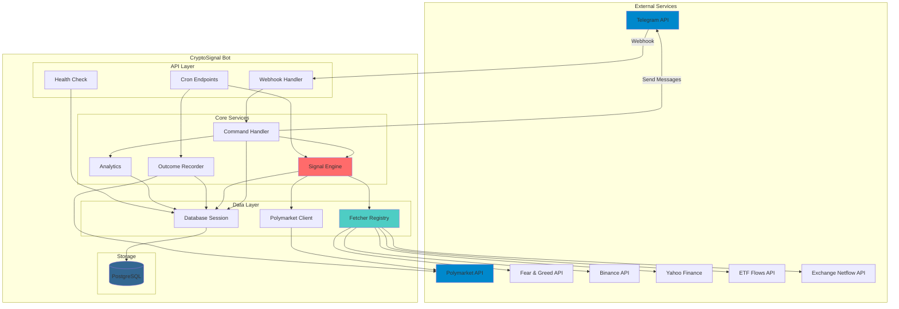
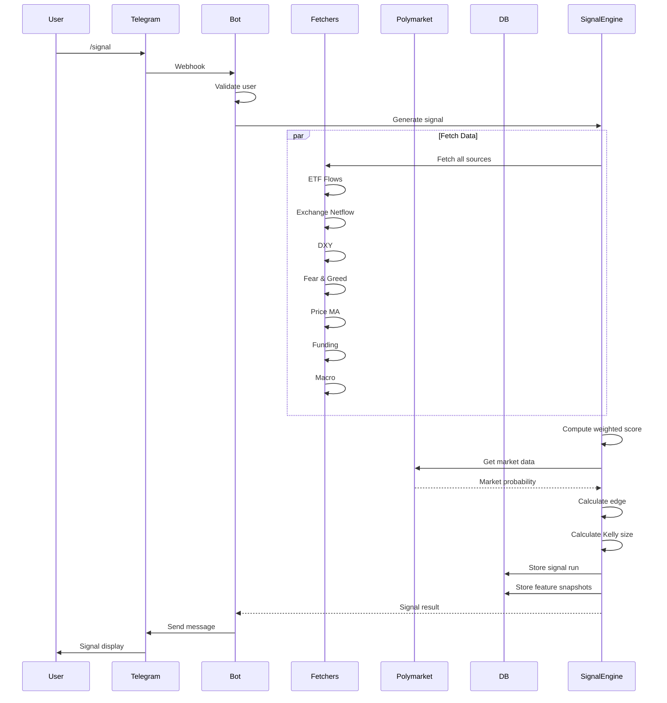
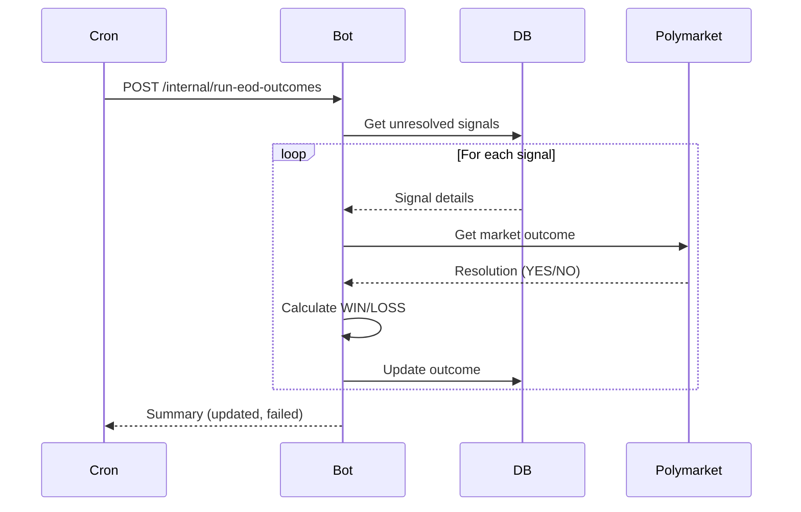
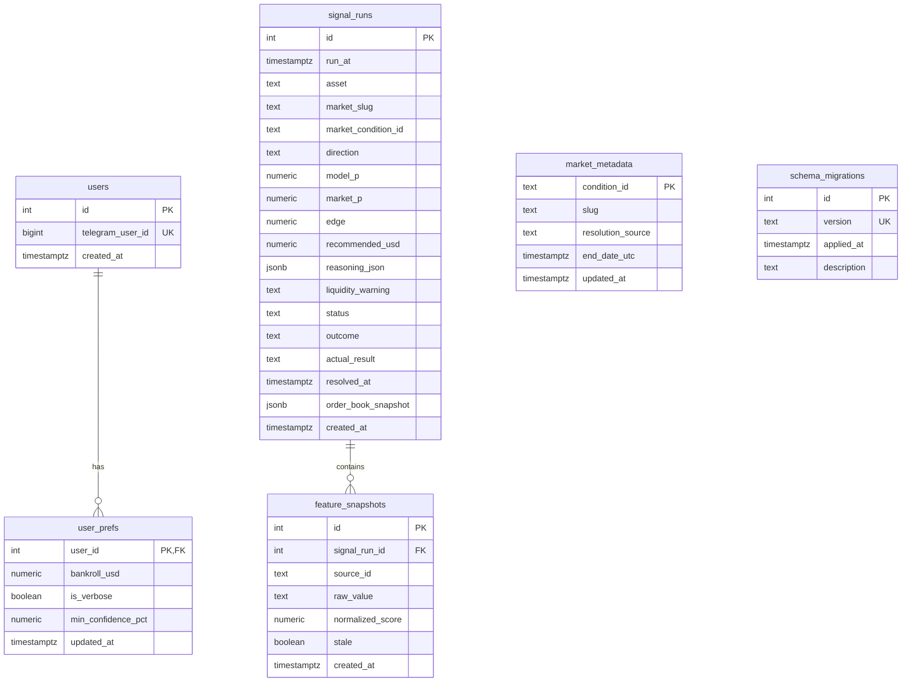
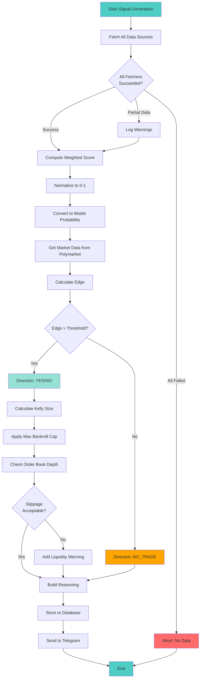

# Architecture

Comprehensive overview of the CryptoSignal bot architecture, components, and data flow.

## Table of Contents

- [System Overview](#system-overview)
- [Architecture Diagram](#architecture-diagram)
- [Components](#components)
- [Data Flow](#data-flow)
- [Database Schema](#database-schema)
- [Signal Generation Pipeline](#signal-generation-pipeline)
- [Technology Stack](#technology-stack)
- [Design Patterns](#design-patterns)
- [Security Model](#security-model)

---

## System Overview

CryptoSignal is a **signals-only Telegram bot** that generates daily Bitcoin trading recommendations for Polymarket prediction markets. It uses expected value (EV) analysis, Kelly criterion for position sizing, and multiple data sources to make informed predictions.

### Key Characteristics

- **Signals-only**: Provides recommendations, does not execute trades
- **EV-based**: Calculates edge between model probability and market probability
- **Risk-managed**: Uses fractional Kelly criterion for position sizing
- **Resilient**: Circuit breakers, retries, graceful degradation
- **Observable**: Structured logging, health monitoring, analytics
- **Extensible**: Modular fetcher system, pluggable data sources

---

## Architecture Diagram



---

## Components

### 1. API Layer

**FastAPI Application** (`src/app/main.py`)
- **Health Endpoint**: `/health` - Database status, last signal time
- **Webhook Endpoint**: `/webhook/telegram` - Receives Telegram updates
- **Cron Endpoints**: `/internal/*` - Daily signal, EOD outcomes, heartbeat
- **API Endpoints**: `/api/signals`, `/api/stats` - Read-only data access

**Lifespan Management**:
- Initializes database connection pool on startup
- Validates production configuration
- Gracefully closes connections on shutdown

### 2. Telegram Integration

**Webhook Handler** (`src/app/telegram/webhook.py`)
- Validates `X-Telegram-Bot-Api-Secret-Token` header
- Returns 403 for invalid/missing secrets
- Routes updates to command handler

**Command Handler** (`src/app/telegram/handler.py`)
- Whitelists users (checks `TELEGRAM_ALLOWED_USER_IDS`)
- Dispatches commands: `/start`, `/signal`, `/stats`, `/history`, `/settings`, `/help`
- Rate limiting per user/command

**Commands** (`src/app/telegram/commands.py`):
- `/signal` - Generate today's signal
- `/stats` - Win rate, streak, drawdown, calibration
- `/history N` - Last N signals with outcomes
- `/settings` - Configure bankroll, verbosity, min confidence

**Message Formatting** (`src/app/telegram/formatter.py`):
- Emoji-rich signal displays
- Table formatting for stats
- Conditional verbosity (show/hide reasoning)

### 3. Data Fetchers

**Fetcher Registry** (`src/app/fetchers/registry.py`)
- Orchestrates parallel fetching from all sources
- Applies circuit breaker pattern
- Handles failures gracefully (partial data OK)

**Base Fetcher** (`src/app/fetchers/base.py`):
- Retry logic with exponential backoff
- Circuit breaker (open after N failures)
- Caching with TTL
- Structured error logging

**Implemented Fetchers**:
- `etf_flows.py` - Bitcoin ETF flow indicator
- `exchange_netflow.py` - Exchange net flow (requires paid API)
- `dxy.py` - Dollar Index 5-day trend
- `fear_greed.py` - Crypto Fear & Greed Index
- `funding.py` - Futures funding rates
- `price_ma.py` - Price vs moving averages
- `macro.py` - Macro factor aggregation
- `coinbase_premium.py` - Coinbase premium (optional)
- `stablecoin_issuance.py` - Stablecoin supply (optional)

### 4. Signal Engine

**Engine Orchestrator** (`src/app/signal/engine.py`):
1. Fetch all data sources in parallel
2. Compute weighted score from normalized features
3. Convert score to model probability
4. Get market probability from Polymarket
5. Calculate edge (Model_P - Market_P)
6. Apply edge threshold filter
7. Calculate Kelly-based position size
8. Build reasoning summary
9. Store in database

**Edge Calculator** (`src/app/signal/edge.py`):
- Computes directional edge
- Determines YES/NO/NO_TRADE
- Applies minimum edge threshold

**Kelly Sizer** (`src/app/signal/kelly.py`):
- Fractional Kelly formula
- Respects max bankroll % cap
- Handles edge cases (negative edge, extreme probabilities)

**Feature Weighting** (`src/app/signal/weights.py`):
- Configurable weights per source
- Normalized to sum to 1.0
- Override via environment variables

**Reasoning Builder** (`src/app/signal/reasoning.py`):
- Explains signal logic
- Shows which factors contributed most
- Flags stale/missing data

### 5. Polymarket Integration

**Gamma API Client** (`src/app/polymarket/client.py`):
- Public API for market data
- No auth required
- Rate limited

**CLOB API Client** (optional):
- Higher rate limits
- Requires API key
- Used for order book depth

**Market Selection** (`src/app/polymarket/selection.py`):
- Filters for BTC daily markets
- Checks market status (open, not resolved)
- Validates end times

**Order Book Analysis** (`src/app/polymarket/depth.py`):
- Calculates total liquidity
- Estimates slippage for given size
- Warns on thin markets

### 6. Outcome Recording

**EOD Recorder** (`src/app/outcomes/recorder.py`):
- Runs daily after market close (00:00+ UTC)
- Fetches market resolution from Polymarket
- Marks signals as WIN/LOSS/SKIP
- Stores actual outcome (YES/NO)
- Updates resolved_at timestamp

**Resolution Fetcher** (`src/app/outcomes/resolution.py`):
- Queries Polymarket for final outcome
- Handles edge cases (voided markets, delays)

### 7. Analytics

**Backtesting** (`src/app/analytics/backtest.py`):
- Replays historical signals
- Simulates P&L
- Calculates realized returns

**Calibration** (`src/app/analytics/calibration.py`):
- Groups predictions by confidence bucket
- Compares predicted vs actual win rates
- Detects over/under-confidence

**Rolling Metrics** (`src/app/analytics/rolling.py`):
- Win rate over last N signals
- Current streak (wins/losses)
- Time-weighted metrics

**Drawdown** (`src/app/analytics/drawdown.py`):
- Tracks peak-to-trough equity
- Calculates max drawdown
- Recovery analysis

**Factor Attribution** (`src/app/analytics/factor_attribution.py`):
- Which features correlated with wins
- Feature importance analysis

### 8. Database Layer

**Session Manager** (`src/app/db/session.py`):
- asyncpg connection pool
- Pool size: 1-5 connections
- Context manager for transactions
- Health check function

**Data Access Modules**:
- `signal_runs.py` - Signal CRUD operations
- `feature_snapshots.py` - Feature data storage
- `market_metadata.py` - Market condition tracking
- `user_prefs.py` - User settings

---

## Data Flow

### Signal Generation Flow



### EOD Outcome Recording Flow



---

## Database Schema



**Key Tables:**

- **users**: Whitelisted Telegram users
- **user_prefs**: Per-user settings (bankroll, verbosity)
- **signal_runs**: One row per signal (direction, edge, outcome)
- **feature_snapshots**: Raw/normalized values from each fetcher
- **market_metadata**: Market info for outcome resolution
- **schema_migrations**: Applied migration tracking

**Indexes:**
- `signal_runs.run_at` - Fast time-based queries
- `signal_runs.outcome` - Filter by WIN/LOSS
- `feature_snapshots.signal_run_id` - Join with signals

---

## Signal Generation Pipeline



---

## Technology Stack

### Backend
- **Python 3.11+** - Modern async syntax, type hints
- **FastAPI** - High-performance web framework
- **asyncpg** - Fast PostgreSQL driver
- **uvicorn** - ASGI server

### Database
- **PostgreSQL 15+** - Relational database for signals, outcomes
- **asyncpg pool** - Connection pooling for performance

### External APIs
- **Telegram Bot API** - Messaging platform
- **Polymarket Gamma API** - Market data (free)
- **Polymarket CLOB API** - Order book (optional)
- **Binance API** - Price and funding data
- **Yahoo Finance** - DXY (Dollar Index)
- **Alternative.me** - Fear & Greed Index

### Development
- **pytest** - Testing framework
- **respx** - HTTP mocking
- **ruff** - Fast linting and formatting
- **uv** - Fast package manager

### Deployment
- **Docker** - Containerization
- **docker-compose** - Local orchestration
- **GitHub Actions** - CI/CD

---

## Design Patterns

### 1. Circuit Breaker Pattern

**Purpose**: Prevent cascading failures from flaky external APIs

**Implementation**: `src/app/fetchers/base.py`

```python
class CircuitBreaker:
    - CLOSED: Normal operation, requests pass through
    - OPEN: After N failures, reject immediately
    - HALF_OPEN: After timeout, try one request
```

**Benefits**:
- Fast failure for known-bad endpoints
- Automatic recovery after cooldown
- Prevents resource exhaustion

### 2. Repository Pattern

**Purpose**: Separate data access from business logic

**Implementation**: `src/app/db/*.py`

```python
# Data access layer
await signal_runs.create(...)
await signal_runs.get_last_signal_at()

# Business logic doesn't know about SQL
```

**Benefits**:
- Easier testing (mock repositories)
- Centralized query logic
- Future ORM migration path

### 3. Strategy Pattern

**Purpose**: Pluggable fetcher implementations

**Implementation**: `src/app/fetchers/base.py`

```python
class BaseFetcher(ABC):
    @abstractmethod
    async def fetch(self) -> dict
```

**Benefits**:
- Easy to add new data sources
- Uniform error handling
- Independent testing

### 4. Command Pattern

**Purpose**: Telegram command dispatch

**Implementation**: `src/app/telegram/handler.py`

```python
HANDLERS = {
    "start": handle_start,
    "signal": handle_signal,
    "stats": handle_stats,
}
```

**Benefits**:
- Extensible command system
- Clear separation of concerns
- Easy to add/remove commands

---

## Security Model

### Authentication & Authorization

**Webhook Validation**:
- Telegram sends `X-Telegram-Bot-Api-Secret-Token`
- Bot verifies against `TELEGRAM_WEBHOOK_SECRET`
- Invalid requests rejected with 403

**User Whitelisting**:
- Only `TELEGRAM_ALLOWED_USER_IDS` can use bot
- Checked on every command
- Unauthorized users get friendly rejection

**Cron Job Protection**:
- Internal endpoints require `X-Cron-Secret` header
- Matches `EOD_CRON_SECRET` from environment
- Prevents unauthorized signal generation

### Data Protection

**Environment Variables**:
- Secrets in `.env` (never committed)
- Validated on startup
- Logged errors don't expose secrets

**Database Security**:
- No SQL injection (uses parameterized queries)
- Connection pool with timeout
- User-specific data isolated

**API Rate Limiting**:
- Telegram: Per-user command throttling
- External APIs: Respect rate limits with retries

### Attack Surface

**Exposed Endpoints**:
- `/webhook/telegram` - Telegram only, validated
- `/internal/*` - Secret-protected
- `/health` - Read-only, safe to expose

**Not Exposed**:
- Database credentials
- API keys
- Webhook secrets

---

## Scalability Considerations

### Current Architecture (Single Instance)

**Bottlenecks**:
- Database connection pool (max 5 connections)
- Single-threaded signal generation
- In-memory circuit breaker state

**Capacity**:
- ~100 users
- ~1000 signals/day
- Low latency (<2s for /signal)

### Future Scaling Options

**Horizontal Scaling**:
- Add load balancer
- Run multiple instances
- Use Redis for circuit breaker state
- Shared PostgreSQL instance

**Database Optimization**:
- Read replicas for analytics
- Partitioning for signal_runs (by month)
- Materialized views for stats

**Caching**:
- Redis for fetcher results
- CDN for static assets (if web UI added)

---

## Extension Points

### Adding New Data Sources

1. Create fetcher in `src/app/fetchers/`
2. Inherit from `BaseFetcher`
3. Implement `fetch()` method
4. Add to `FetcherRegistry`
5. Add weight to `weights.py`

### Adding New Commands

1. Add handler to `src/app/telegram/commands.py`
2. Register in `handler.py`
3. Update `/help` text
4. Add tests in `tests/unit/`

### Adding New Analytics

1. Create module in `src/app/analytics/`
2. Add database queries as needed
3. Expose via `/api/stats` or new endpoint
4. Add tests

---

**Next Steps:**
- [Development Guide](./DEVELOPMENT.md) - Contributing and customization
- [API Reference](./runbook.md) - Endpoint documentation
- [Testing Guide](../tests/README.md) - Test structure

---

**Questions?** See [TROUBLESHOOTING.md](./TROUBLESHOOTING.md) or open an issue.
